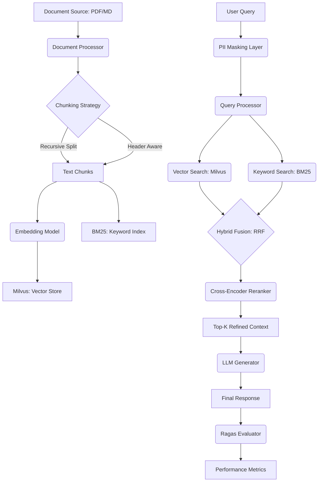

# Enterprise-RAG-Architecture

A high-performance, production-grade Retrieval Augmented Generation (RAG) framework focused on hybrid search, advanced document ingestion, and enterprise scalability.

## 🏗️ Technical Architecture

The system implements a modular architecture designed for high availability and retrieval precision. It leverages a **Hybrid Search** strategy, combining dense vector embeddings with sparse keyword retrieval and a **Cross-Encoder Reranking** layer to maximize context relevance.

### 📊 System Workflow (Mermaid)



## 🚀 Key Features

### 1. Hybrid Retrieval & Reranking
Combines the semantic power of Transformers (`all-MiniLM-L6-v2`) with the precision of keyword-based BM25. Results are fused using **Reciprocal Rank Fusion (RRF)** and then refined by a **Cross-Encoder (`ms-marco-MiniLM-L-6-v2`)** to ensure top-tier relevance.

### 2. Automated Evaluation Suite
Integrated `ragas` metrics to monitor the quality of the RAG pipeline continuously.
- **Faithfulness**: Ensures the answer is derived strictly from the retrieved context.
- **Answer Relevancy**: Measures how well the answer addresses the user's query.
- **Context Precision/Recall**: Validates the effectiveness of the retrieval stage.

### 3. Enterprise Security
- **PII Masking**: A professional-grade layer that detects and masks Personal Identifiable Information (Emails, Phone numbers, SSNs, etc.) before queries are sent to external LLMs.

### 4. Production Orchestration
Full `docker-compose` support for:
- **Milvus**: Distributed vector database for high-scale retrieval.
- **Redis**: High-performance caching for frequent queries and session state.
- **FastAPI**: Asynchronous API layer with robust error handling.

## 🛠️ Installation & Setup

### Prerequisites
- Docker & Docker Compose
- Python 3.9+

### Quick Start
```bash
# Clone the repository
git clone https://github.com/your-org/Enterprise-RAG-Architecture.git
cd Enterprise-RAG-Architecture

# Launch Infrastructure (Milvus, Redis)
docker-compose -f infrastructure/docker-compose.yml up -d

# Install dependencies
pip install -r requirements.txt
```

## 💻 Usage

### Running the API
```bash
uvicorn src.api.main:app --host 0.0.0.0 --port 8000
```

### Reranking Example
```python
from src.rag.reranker import CrossEncoderReranker

reranker = CrossEncoderReranker()
top_docs = reranker.rerank(query="How to scale Milvus?", documents=candidate_docs)
```

## 📈 MLOps for RAG

The repository follows MLOps best practices for RAG:
1. **Experiment Tracking**: Use the `RAGEvaluator` to compare different embedding models and chunking strategies.
2. **CI/CD Integration**: Automated evaluation runs as part of the pipeline to prevent retrieval regression.
3. **Observability**: Metrics are calculated for every production query to monitor drift in answer quality.

---
**Maintained by**: Senior Data & AI Engineering Team
