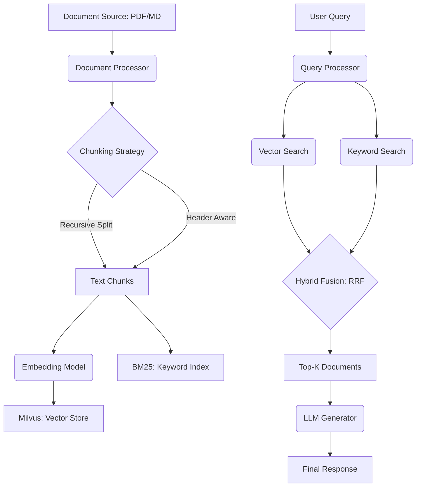

# Enterprise-RAG-Architecture

A high-performance, production-ready Retrieval Augmented Generation (RAG) framework focused on hybrid search, advanced document ingestion, and enterprise scalability.

## 🏗️ Architecture Overview

The system implements a modular architecture designed for high availability and retrieval precision. It leverages a **Hybrid Search** strategy, combining dense vector embeddings with sparse keyword retrieval to maximize context relevance.

### Core Components

- **Ingestion Pipeline**: Advanced chunking and semantic splitting for PDFs and Markdown using LangChain.
- **Hybrid Retriever**: Implements **Reciprocal Rank Fusion (RRF)** to merge results from Milvus (Dense) and BM25 (Sparse).
- **Inference API**: A robust FastAPI layer with Pydantic validation and performance monitoring.
- **Evaluation Engine**: Standardized metrics for retrieval precision and latency.

### 📊 System Workflow (Mermaid)



## 🚀 Key Features

- **Milvus Integration**: Designed to scale to millions of vectors with low latency.
- **Hybrid Retrieval**: Combines the semantic power of Transformers (`all-MiniLM-L6-v2`) with the precision of keyword-based BM25.
- **Advanced Ingestion**: Uses recursive character splitting and markdown header awareness for optimal context preservation.
- **Production-Ready API**: Features async request handling, timing middleware, and structured error responses.

## 🛠️ Installation

```bash
# Clone the repository
git clone https://github.com/your-org/Enterprise-RAG-Architecture.git
cd Enterprise-RAG-Architecture

# Install dependencies
pip install -r requirements.txt
```

## 💻 Usage

### Running the API

```bash
uvicorn src.api.main:app --host 0.0.0.0 --port 8000
```

### Ingestion Example

```python
from src.ingestion.document_processor import DocumentProcessor

processor = DocumentProcessor(chunk_size=500, chunk_overlap=50)
chunks = processor.load_pdf("path/to/report.pdf")
# Load into Milvus...
```

## 🧪 Testing

The repository includes a comprehensive test suite using `pytest`.

```bash
pytest tests/
```

## 📈 Evaluation Metrics

The system is optimized for:
- **Mean Reciprocal Rank (MRR)**: Measures the ranking quality of the first relevant document.
- **Hit Rate @ K**: Frequency of finding the correct context within top-K results.
- **Retrieval Latency**: P99 response times monitored via API middleware.

---
**Maintained by**: Senior Data & AI Engineering Team
